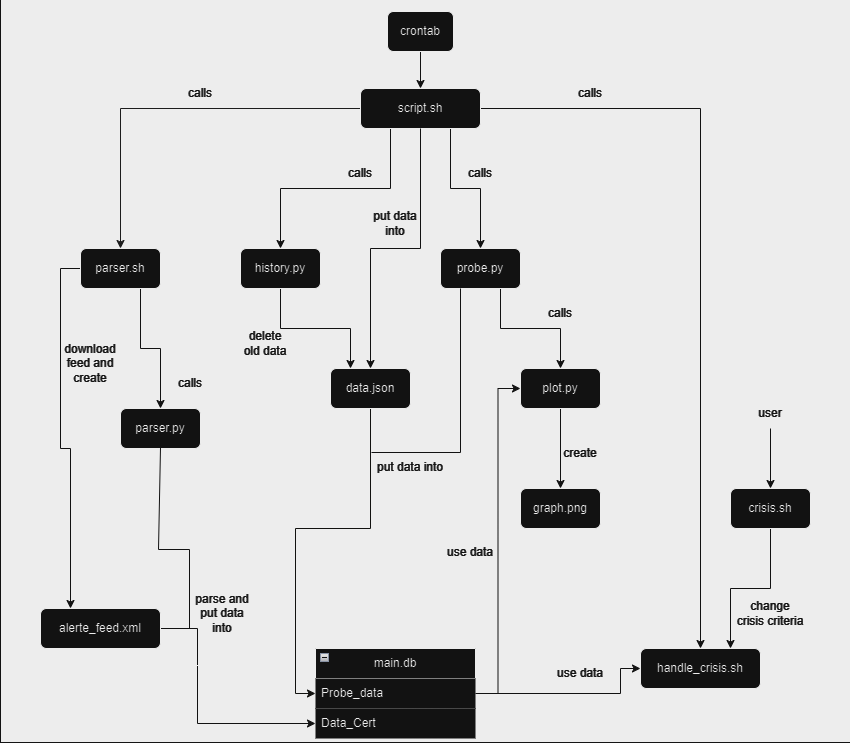

# README

## This project is under the GNU General Public Licence v3.0.

## Purpose

This project was done in the context of the "Operating System Administration" course at Université d'Avignon.<br>
It's purpose was to familiarise with an Ubuntu virtual machine environment.<br>

I used Pyhton et Bash to create probes in order to get system information, and then create graphs on the data, which are displayed on a html page.<br>

## Explanation

A crontab is used to call every 5 minutes the file **script.sh** which itself calls successively **parser.sh**, **history.py**, **probe.py** and **handle_crisis.sh**.

For the sake of clarity, this is a draft of what the scripts do. It must be read from left to right and from the top to the bottom, as scripts are called sequentially.<br>



I purposely didn't include in this draft logs and intermediary text files, as it is not necessary to understand the global functioning.<br>


## Download

### Virtual Machine

If you are on running on *Windows*, you will need to download a virtual machine to emulate an Ubuntu os. I personnaly used [Oracle VM VirtualBox](https://www.oracle.com/fr/virtualization/technologies/vm/downloads/virtualbox-downloads.html).<br>
After downloading you're VM, you need to configure an Ubuntu virtual system. There is plenty documentation online to do so, and it is quite intuitive.<br>
You won't need more than 10GB of memory and 4Gb of RAM to make this project work.<br>
You will need to redirect the **port 80** of you VM to a port of your machine, I personnaly used 8008.<br>


I you are already running on *Ubuntu*, then you shoudn't have any problem.<br>

### Put folder into VM

After downloading the **OS_Project** folder, you need to put it inside the VM.<br>
You can follow the following steps to create a _shared folder_ between *windows* an your VM.<br>

**Set up Shared Folders:**
- Shut down your Ubuntu virtual machine.
- In the VirtualBox manager, select your Ubuntu virtual machine and click on Settings.
- Go to the Shared Folders section.
- Click on the "Add new shared folder" icon (folder with a green plus sign).
- Choose a folder on your Windows host machine that you want to share with the Ubuntu VM. Provide a name for the shared folder.
- Click OK to save the settings.

**Mount Shared Folder in Ubuntu VM:**
- Start your Ubuntu virtual machine.
- Open a terminal in Ubuntu.
- Create a directory where you want to mount the shared folder. For example:
```bash
mkdir ~/shared
```
- Mount the shared folder using the following command:
```bash
sudo mount -t vboxsf <shared_folder_name> ~/shared
```
- Replace <shared_folder_name> with the name of the shared folder you set up in VirtualBox.
- Your shared folder should now be accessible in Ubuntu at the specified mount point (~/shared in this example).

You can now put the **OS_Project** folder into you shared folder on windows and you be able to access it on your VM. 

### Packages

You will now need to install all the packages necessary to run this project.<br>
To do so, you just have to run **install_package.sh**.<br>
You can check inside the file to see all the packages that are used.<br>

### Permission

Now that you downloaded the folder, execute the following command, so you don't have to worry about permissions.<br>
```bash
sudo chmod 777 OS_Project html -R
```

### Apache2 and html folder

In the html folder, you will find the **index.html** and **styles.css** files, and <br>
You need to put the two files in the */var/www/html*.
```bash 
cd html
mv index.html styles.css /var/www/html
```
There is also the **project.conf** file, move it into */etc/apache2/sites-availaible/* and activate site, then restart Apache.<br>
```bash
mv project.conf /etc/apache2/sites-available/
sudo a2ensite html
sudo systemctl restart apache2
```
On *windows*, you need to access *C:\Windows\System32\drivers\etc\hosts* with an editor (Notepad will do) as an administrator and add this line :<br>
```txt
127.0.0.1 project.local
```

You can now access the website using *http://project.local:8008*.<br>


## Usage 

Finally, you need to configure a cron to execute **script.sh**<br>
```bash
sudo crontab -e
```
To configure it, add a line of instructions, here's an example :<br>
```txt
*/5 * * * * bash absolute_path/OS_Project/script.sh
```
This will make the cron execute **script.sh** every 5 minutes. You need to replace **absolute_path** by your absolute path to **OS_Project**.<br>

**You will need to replace absolute path in each file to match yours.**<br>

You can configure the crisis requirement by executing **crisis.sh** in **Crisis** folder.<br>
